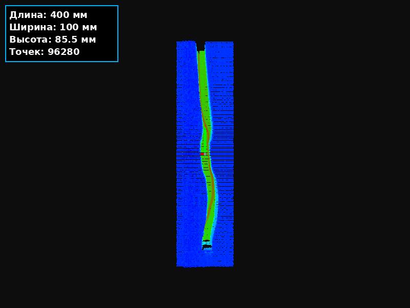

# 3D Стерео-Сканер со Структурированным Светом

> **Профилометр на основе лазерной линии и двух камер для 3D-сканирования в реальном времени**

[](LICENSE)
[](https://www.python.org/)
[](https://opencv.org/)
[](http://www.open3d.org/)

---

## 📸 Демонстрация

### Сканирование в реальном времени


### 3D-реконструкция



## 🎯 Что это такое?

Это **3D-профилометр**, который сканирует поверхность объекта с помощью:
- **Лазерной линии** (структурированный свет)
- **Двух стереокамер** для триангуляции
- **Субпиксельной обработки** для точности до 0.1 мм

### Принцип работы:
1. **Лазерная линия** проецируется на объект
2. **Две камеры** синхронно снимают искаженную линию
3. **Алгоритм** находит центры линии с субпиксельной точностью
4. **Стереотриангуляция** вычисляет 3D-координаты каждой точки
5. **Профили** собираются в 3D-облако при движении объекта

---

## 📁 Структура проекта

```
structure_light/
├── experiments/
│   ├── 7_3d_stereo_scanner.py   # Основной скрипт сканера
│   ├── 8_view_3d.py              # Просмотр 3D-скана
│   ├── create_gif_simple.py      # Создание GIF из скана
│   └── trim_video.py             # Обрезка видео
├── config.json                    # Настройки калибровки
├── stereo_calibration.npz        # Карты стереовыпрямления
├── scan_3d.npy                   # Сохраненный 3D-скан
├── media/                         # Медиафайлы
│   ├── scan_preview.mp4
│   └── 3d_scan_final.gif
└── README.md
```

---

## 🚀 Быстрый старт

### 1. Установка зависимостей
```bash
pip install opencv-python numpy open3d pillow imageio matplotlib pyautogui
```

### 2. Калибровка
Убедись, что в папке есть:
- `config.json` — настройки ROI и порогов
- `stereo_calibration.npz` — карты выпрямления

### 3. Запуск сканера
```bash
python experiments/7_3d_stereo_scanner.py
```

### Управление:
- `b` — калибровка нуля (захват фона)
- `r` — запись 3D-скана (10 секунд)
- `c` — калибровка масштаба по эталону 15 мм
- `q` / `ESC` — выход

---

## 🔧 Калибровка системы

### Аппаратная настройка:
| Компонент | Описание |
|---|---|
| **Камера 1 (левая)** | Index 1, разрешение 1920x1080 |
| **Камера 2 (правая)** | Index 0, разрешение 1920x1080 |
| **Проектор** | Синяя лазерная линия, разрешение 1920x1080 |

### Конфигурация (`config.json`):
```json
{
  "Threshold": 248,        // Порог яркости для линии
  "Min_Intensity": 139,    // Минимальная интенсивность
  "roi_l_start": 1093,     // Левая ROI (X начальная)
  "roi_l_end": 1264,       // Левая ROI (X конечная)
  "roi_r_start": 712,      // Правая ROI (X начальная)
  "roi_r_end": 1022        // Правая ROI (X конечная)
}
```

---

## 🎨 Интерфейс

Главное окно сканера содержит:

| Панель | Содержимое |
|---|---|
| **Видео** | Левый и правый кадры с отмеченной ROI |
| **График** | Профиль линии в реальном времени |
| **Статус** | Информация о состоянии и измерениях |


*(Добавь скриншот интерфейса)*

---

## 📊 Форматы данных

### Сохранение профилей (`scan_3d.npy`)
- Массив `(n_frames × n_points)`
- Каждая строка — профиль строки
- Значения — высота в мм

### Визуализация
```python
import numpy as np
import open3d as o3d

profiles = np.load("scan_3d.npy")
# Создание облака точек...
```

### Создание GIF
```bash
python experiments/create_gif_simple.py
```

---

## 🛠 Технические детали

### Алгоритмы:
| Компонент | Метод |
|---|---|
| **Поиск линии** | Субпиксельный центроид (взвешенное среднее) |
| **Стерео** | Триангуляция через матрицу Q |
| **Фильтрация** | Пороговая + медианная |
| **Сглаживание** | Экспоненциальное (α=0.15) |
| **Калибровка** | По эталонному блоку 15 мм |

### Производительность:
- **Частота кадров**: ~30 FPS
- **Точность**: ±0.1 мм
- **Разрешение профиля**: 1080 точек на строку
- **Время записи**: 10 секунд

---

## 📈 Примеры результатов

### 3D-скан волны (400 мм)


### Обработка профиля


---

## 🤝 Вклад в проект

Хочешь улучшить проект?
1. Форкни репозиторий
2. Создай ветку (`git checkout -b feature/amazing`)
3. Закоммить изменения (`git commit -m 'Add amazing feature'`)
4. Отправь пул-реквест

---

## 📝 Лицензия

MIT License — свободно используй, модифицируй и распространяй.

---

## ✨ Благодарности

- OpenCV за мощную обработку изображений
- Open3D за 3D-визуализацию
- Сообществу за вдохновение

---

## 📬 Контакты

**Автор**: AntoniSopka97  
**GitHub**: [AntoniSopka97](https://github.com/AntoniSopka97)

---

## ⚠️ Заметки

### Устранение проблем
| Проблема | Решение |
|---|---|
| Нет видео с камер | Проверь индексы камер (1 и 0) |
| Линия не находится | Отрегулируй `Threshold` и `Min_Intensity` |
| Нет 3D-окна | Установи `open3d` и `matplotlib` |
| GIF не создается | Установи `pillow` и `imageio` |

### Рекомендации
1. Используй **темный фон** для лучшего контраста
2. Двигай объект **равномерно** для хорошего 3D-скана
3. Калибруй систему **при каждом включении**
4. Для высокого качества используй **штатив**

---

### Как добавить медиафайлы:

1. **Создай папку `media`** в корне проекта
2. **Добавь файлы**:
   - `scan_preview.mp4` — видео работы сканера (обрезанное)
   - `3d_scan_final.gif` — вращающийся 3D-скан
   - `interface.png` — скриншот интерфейса
   - `profile_graph.png` — скриншот графика

3. **Обнови ссылки** в README на свои файлы (через GitHub или imgur)
